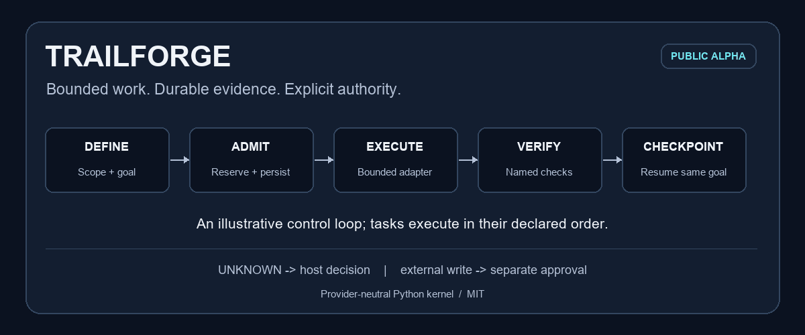
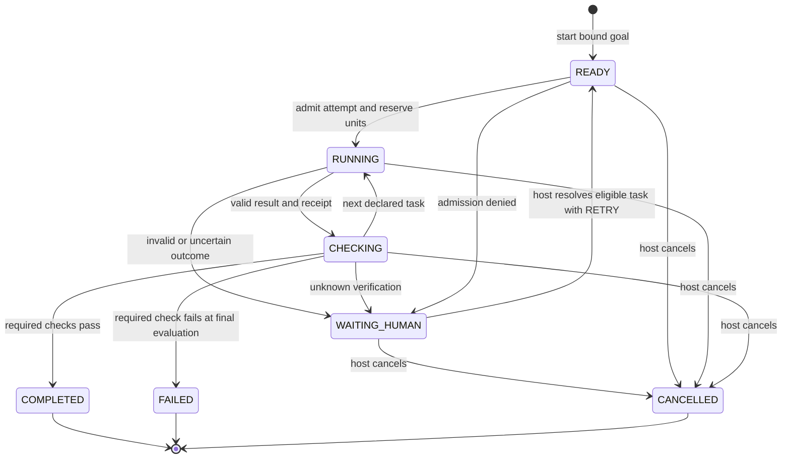
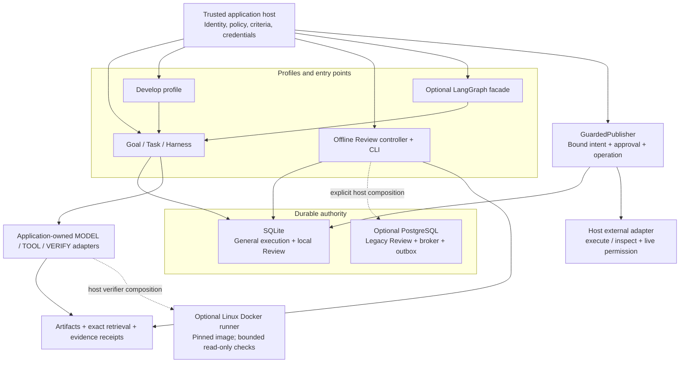
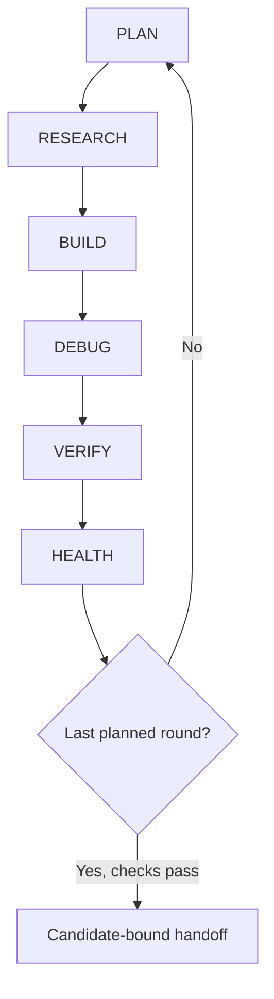
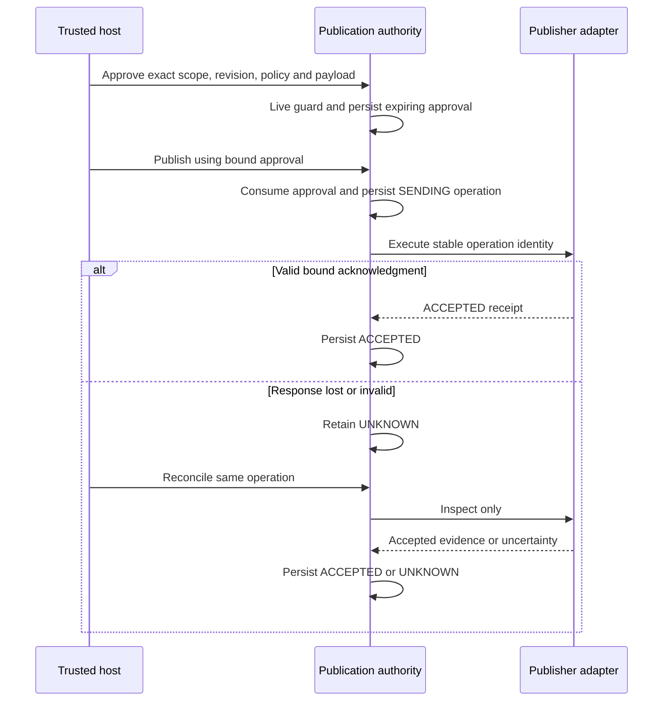

<div align="center">

# Trailforge

### Bounded work. Durable evidence. Explicit authority.

A provider-neutral Python harness for agent workflows that can be checked, resumed and reviewed.

[](https://github.com/codera647/Trailforge/actions/workflows/conformance.yml)
[](https://github.com/codera647/Trailforge/releases/tag/v0.1.0a1)
[](pyproject.toml)
[](LICENSE)



[Static workflow image](docs/assets/workflow.png) · [Quick start](#quick-start) · [Architecture](#architecture) · [Repository structure](#repository-structure) · [Documentation](#documentation)

</div>

Trailforge keeps the execution contract around your application's models and tools: scoped goals, bounded attempts, durable reservations, evidence-bound checks and explicit recovery. Your host supplies identity, provider clients, product policy and acceptance criteria.

**Release status:** `0.1.0a1` is a public **MIT alpha**. The base runtime has **zero third-party runtime dependencies**. APIs can change; this release is not a stable API or production certification. Install from the verified GitHub tag or release wheel; there is no PyPI publication yet.

The animation illustrates a control loop. The diagrams and state descriptions below define the actual execution paths.

## Contents

- [Why Trailforge](#why-trailforge)
- [What ships](#what-ships)
- [Quick start](#quick-start)
- [Pause, resume and inspect](#pause-resume-and-inspect)
- [Embed a workflow](#embed-a-workflow)
- [Architecture](#architecture)
- [Develop profile](#develop-profile)
- [Offline Review profile](#offline-review-profile)
- [Approvals and publication recovery](#approvals-and-publication-recovery)
- [Optional integrations](#optional-integrations)
- [Repository structure](#repository-structure)
- [Verification and supported environments](#verification-and-supported-environments)
- [Security and operating limits](#security-and-operating-limits)
- [Troubleshooting](#troubleshooting)
- [Documentation](#documentation)
- [Contributing and license](#contributing-and-license)

## Why Trailforge

A useful agent needs more than a successful model response. Its host needs to know which work was admitted, what evidence supports the result, whether an interrupted attempt may have completed and who can authorize the next effect.

Trailforge provides:

| Capability | Concrete behavior |
| --- | --- |
| Durable progress | SQLite checkpoints and journals persist admitted tasks and accepted results. |
| Explicit scope | Goals bind tenant/resource identity, inputs and registered adapter capabilities. |
| Bounded work | Finite task plans, per-task attempts and declared-unit goal/tenant/global caps. |
| Required checks | Typed `VerifiedResult` values bind PASS, FAIL or UNKNOWN to the admitted goal. |
| Honest recovery | Unknown outcomes retain consumed attempts and reservations; the host resolves them explicitly. |
| Evidence integrity | Review findings cite exact captured bytes, line ranges, revisions and receipts. |
| Guarded publication | Exact intent approval, durable operation identity and inspect-only reconciliation. |
| Reusable ports | Model, tool, verification, artifact, retrieval, workflow, publication and telemetry contracts. |

Declared resource units are **not** measured tokens or dollars. Receipts are **integrity records**, not digital signatures. A workflow passing its checks is not a guarantee that an arbitrary model answer is correct.

## What ships

| Surface | Included | Host work or boundary |
| --- | --- | --- |
| General `Harness` | `Goal`/`Task` API, SQLite authority and bounded synchronous adapters | Real provider clients, timeouts, identity and product-specific checks |
| `Develop` | PLAN → RESEARCH → BUILD → DEBUG → VERIFY → HEALTH; candidate/check binding | Five trusted phase adapters and protected acceptance criteria |
| Offline Review CLI | Ten original mock fixtures, source validation, coverage and draft output | Live GitHub intake and real model-review quality evaluation |
| `GuardedPublisher` | Exact approval, consumed authority, durable UNKNOWN/ACCEPTED state | Real external adapter and live authenticated authorization |
| Docker runner | Digest-pinned, bounded Linux-container execution | Local Linux daemon, preloaded image and trusted semantic verifier |
| Optional PostgreSQL | Legacy Review/controller, fenced leases, broker and dispatch outbox | Explicit host composition; general Harness and CLI remain SQLite |
| Optional LangGraph | Scheduling facade over kernel-owned checkpoints | No graph-owned approval, provider or independent durability authority |

Incident triage is a future application profile. Customer OAuth, a real GitHub comment publisher, a built-in live model provider, learned routing and generic distributed PostgreSQL execution are not included in this alpha.

## Quick start

### Requirements

- **Python 3.11 or newer** and Git for a source install.
- A writable local directory for private stores and exports.
- No provider key, Docker or database service for the base offline demonstration.

### Linux source install

```bash
git clone --branch v0.1.0a1 --depth 1 https://github.com/codera647/Trailforge.git
cd Trailforge
python3 -m venv .venv
source .venv/bin/activate
python -m pip install .
python -m trailforge --version
```

### Windows PowerShell source install

These commands use the environment interpreter directly and do not require activation or an execution-policy change. Select an installed supported Python version if `py -3.13` is unavailable.

```powershell
git clone --branch v0.1.0a1 --depth 1 https://github.com/codera647/Trailforge.git
Set-Location Trailforge
py -3.13 -m venv .venv
.\.venv\Scripts\python.exe -m pip install .
.\.venv\Scripts\python.exe -m trailforge --version
```

For subsequent `python` commands in this README, Windows users can substitute `.\.venv\Scripts\python.exe`. Keep the same environment throughout.

### Install without a source checkout

Within your virtual environment:

```bash
python -m pip install "git+https://github.com/codera647/Trailforge.git@v0.1.0a1"
```

Alternatively, download `trailforge-0.1.0a1-py3-none-any.whl` and `SHA256SUMS.txt` from the [alpha release](https://github.com/codera647/Trailforge/releases/tag/v0.1.0a1), compare the wheel's SHA-256, then install it locally:

```bash
python -m pip install ./trailforge-0.1.0a1-py3-none-any.whl
```

Use `sha256sum` on Linux or `Get-FileHash -Algorithm SHA256` on PowerShell for the comparison. Bundled fixtures work from the installed wheel; repository scripts such as `examples/data_pipeline.py` require a source checkout or source distribution.

### Run the offline demonstration

```bash
python -m trailforge init trailforge-demo
python -m trailforge evaluate --suite trailforge-demo
python -m trailforge run --fixture trailforge-demo/buggy-python --store runs.sqlite3
```

Expected results:

- Version: `0.1.0a1`.
- Evaluation: `status: PASS` across ten original synthetic mock fixtures.
- Buggy Python review: a `COMPLETE` draft with one validated finding about empty-input division.

`init` requires a new directory. The suite argument is the **directory containing `suite.json`**, not the JSON file path. Fixture source is read as data and never executed by these CLI commands. A synthetic PASS measures workflow behavior, not real defect detection or calibrated confidence.

## Pause, resume and inspect

```bash
python -m trailforge run --fixture trailforge-demo/buggy-python --store runs.sqlite3 --pause-after snapshot
```

Copy the returned `run_id`. Replace `YOUR_RUN_ID` in the commands below, keeping the same store and unchanged fixture:

```bash
python -m trailforge resume --fixture trailforge-demo/buggy-python --store runs.sqlite3 --run-id YOUR_RUN_ID
python -m trailforge inspect --store runs.sqlite3 --run-id YOUR_RUN_ID
python -m trailforge export --store runs.sqlite3 --run-id YOUR_RUN_ID --output review.json
```

Review pause points are `snapshot`, `review` and `validation`. Export refuses to overwrite an existing file. JSON results go to stdout; run/error metadata goes to stderr. `trailforge` is also installed as a console command.

Default inspection includes draft findings and quotations. `--include-source` exposes the full checkpoint, including admitted source. Protect stores and exports as project data. Command exit code `0` can accompany a `PARTIAL` draft or an `UNKNOWN` simulation result; inspect the JSON outcome. A failing evaluation returns `1`; local contract/OS/SQLite denials return `2` with sanitized `LOCAL_OPERATION_DENIED`.

## Embed a workflow

Use `Goal`, `Task` and `Harness` for application-neutral work. This complete example sums a dataset, pauses after the first task and resumes from durable state before verification:

```python
from trailforge.ports import AdapterCapabilities, FunctionAdapter, VerifiedResult
from trailforge.runtime import Goal, Harness, Task


def total(request):
    return {"total": sum(request.input["values"])}


def verify(request):
    observed = request.dependencies["sum"]["total"]
    verdict = "PASS" if observed == request.input["expected"] else "FAIL"
    return VerifiedResult(verdict, request.goal_digest, {"observed": observed})


adapters = [
    FunctionAdapter(AdapterCapabilities("example.sum/1", "TOOL"), total),
    FunctionAdapter(AdapterCapabilities("example.verify/1", "VERIFY"), verify),
]
goal = Goal(
    tenant_id="example-tenant",
    resource_id="data-pipeline",
    objective="Sum a dataset and verify its total",
    tasks=(
        Task("sum", "example.sum/1", {"values": [1, 2, 3]}),
        Task("check", "example.verify/1", {"expected": 6}, ("sum",)),
    ),
    required_checks=("check",),
)


def host():
    return Harness(
        "pipeline.sqlite3", tenant_id=goal.tenant_id,
        resource_id=goal.resource_id, adapters=adapters,
    )


harness = host()
run_id = harness.start(goal)
harness.advance(run_id, goal, pause_after="sum")
record = host().advance(run_id, goal)
assert record["state"] == "COMPLETED"
assert record["units_reserved"] == 2
print(record["tasks"]["sum"]["result"])  # {"total": 6}
```

Registered callbacks run synchronously in the **trusted host process**. Effect metadata does not sandbox Python. Tasks execute in their declared topological order; the runtime does not automatically run independent tasks within one goal in parallel. Required checks must be VERIFY-kind tasks returning a typed `VerifiedResult` for the same goal digest.

Run the original source-checkout recipes after installation:

```bash
python examples/data_pipeline.py
python examples/develop_data.py
```

### General runtime recovery



UNKNOWN does not trigger an automatic retry, even for a PURE task. The host inspects the uncertainty and can call `resolve_unknown(..., disposition="RETRY")` or `cancel(...)`. Attempts and reservations remain consumed. A required FAIL is evaluated after the declared sequence; it does not automatically short-circuit every following task. Leases fence late result commits, not provider execution or paid spend.

## Architecture



There are **two distinct execution paths**:

1. **General execution:** `Harness` runs a bound Goal/Task contract. `Develop` builds on it; LangGraph can schedule it. Protocol: `trailforge/execution/0.1`.
2. **Offline Review:** `OfflineController` runs a fixed snapshot/review/validation/draft sequence. Its CLI uses SQLite and mocks. PostgreSQL extends this legacy path through explicit host composition. Protocol: `offline/0.1`.

A queue wakeup, graph state or model reply is an observation, not a second authority. The host reloads the current scoped checkpoint before advancing. External writes use a separate publication boundary.

### Module responsibilities

| Modules | Purpose |
| --- | --- |
| `runtime.py`, `ports.py` | Goal/Task lifecycle, adapter capabilities, bounded requests and verification contracts |
| `store.py`, `core.py`, `contracts.py` | Checkpoints, journal/CAS, canonical digests and legacy contract validation |
| `develop.py` | Candidate workspace, protected check binding, phase wrapping and verified handoff |
| `controller.py`, `evidence.py`, `fixtures.py` | Offline Review, exact source/proposal validation and bounded fixture loading |
| `publication.py` | Intent, approvals, durable dispatch observation and simulation |
| `artifacts.py`, `adapters/retrieval.py` | Scoped content-addressed bytes and revision-bound literal lookup |
| `adapters/sandbox.py`, `adapters/images.py` | Bounded Linux runner and image-identity preparation |
| `adapters/postgres.py`, `dispatch.py` | Legacy fenced Review authority and durable wakeup delivery |
| `broker.py`, `adapters/broker.py`, `adapters/schema.py` | Closed proposals, roles/sessions and optional schema validation |
| `telemetry.py`, `adapters/langgraph.py` | Allowlisted event sink and optional scheduler facade |

## Develop profile



The host declares **one to three rounds before admission**. It supplies exactly five phase adapters; HEALTH is generated by the profile. Only BUILD has candidate-write capability. DEBUG observes and prepares changes for a later BUILD.

`CandidateWorkspace` uses an explicit allowed-path list, bounded regular files and atomic replacement. The protected checks tree is separate from the candidate. Wrappers reject changed checks or a non-BUILD candidate mutation. The final round's VERIFY and HEALTH must pass; handoff rechecks current candidate/check digests.

The diagram shows phase ordering, not an unconditional success loop. Adapter uncertainty or admission denial can hold the run. Earlier failed verification may be followed by a predeclared correction round; no hidden unlimited retry is supplied.

The built-in handoff states `execution_mode: TRUSTED_HOST_CALLBACKS` and `linux_isolation_verified: false`. It authorizes no merge, publication or deployment. A host can separately compose `DockerSandbox` into a verifier and attach its receipt without changing the built-in handoff claim.

See [Develop](docs/develop.md) and [the runnable example](examples/develop_data.py).

## Offline Review profile

The CLI records these fixed stages:

```text
ADMITTED / READY
  -> SNAPSHOT / RUNNING
  -> REVIEWED / CHECKING
  -> VALIDATED / CHECKING
  -> DRAFTED / TERMINAL (COMPLETE or PARTIAL)
```

Role coverage is recorded for security, correctness, tests and documentation. These are configured mock role outcomes in one callback, not four live independent agents. Proposal evidence must match the captured path, revision, content digest, receipt, one-based line range and exact quotation, including line endings.

The fixture classifier recognizes `.py`, `.js` and `.ts`; other suffixes, including `.jsx` and `.tsx`, are unsupported in this loader. Unsupported/truncated input, incomplete roles and rejected findings create coverage gaps. A draft is explicitly `DRAFT` / `MOCK`; findings still require human review. COMPLETE means profile coverage, not semantic correctness.

## Approvals and publication recovery



The CLI demonstrates response loss using a separate durable **local simulator**:

```bash
python -m trailforge approve --store runs.sqlite3 --run-id YOUR_RUN_ID --actor local-operator --simulate --lose-response
python -m trailforge reconcile --store runs.sqlite3 --run-id YOUR_RUN_ID --operation-id YOUR_OPERATION_ID --simulate
```

Replace `YOUR_OPERATION_ID` with the first command's returned identifier. Expected states: **UNKNOWN → ACCEPTED**, without another send. Only COMPLETE drafts can be approved through this CLI. The actor is a local label; no customer authentication or GitHub write occurs.

A real host must supply authenticated identity, current policy/revision checks and a provider-specific `execute`/`inspect` adapter. Approval binds the exact intent and defaults to a 300-second expiry. Revoking it does not undo an accepted effect. Exact-intent replay returns the existing operation instead of resending; there is no universal exactly-once guarantee across arbitrary providers or separate authority files.

See [publication recovery](docs/publication.md).

## Optional integrations

From a source checkout, using its virtual environment:

```bash
python -m pip install ".[schemas]"
python -m pip install ".[postgres]"
python -m pip install ".[langgraph]"
```

| Integration | Direct pinned dependencies | What to configure |
| --- | --- | --- |
| JSON Schema | `jsonschema==4.26.0` | Closed legacy contract validation; semantic gates still apply |
| PostgreSQL | `psycopg[binary]==3.3.6`, `jsonschema==4.26.0` | Scoped `PostgresRunStore`, migration/worker authority and trusted sessions |
| LangGraph | `langgraph==1.2.14` | `LangGraphWorkflow(harness, goal)`; SQLite remains resume authority |
| Local retrieval | None in the base runtime | Exact scope/revision, allowlisted paths and live guard; literal substring lookup |
| Telemetry | None in the base runtime | Explicit host emission to `JsonEventSink`; six allowlisted fields |
| Docker | Separate host software | Local Linux-container daemon, preloaded digest-pinned image and protected criteria |

### PostgreSQL host composition

```python
import os
from trailforge.adapters.postgres import PostgresRunStore

store = PostgresRunStore(
    os.environ["TRAILFORGE_DATABASE_DSN"],
    tenant_id="tenant-a", resource_id="repository-a", schema="trailforge",
)
store.migrate()
```

`TRAILFORGE_DATABASE_DSN` is an example host convention, not automatic library configuration. Use a disposable database to learn migration behavior. The verification scripts separately use `TRAILFORGE_DATABASE_URL`. The adapter supports the legacy Review/controller/broker/outbox, not `Harness(..., backend="postgres")` or a CLI database flag.

### Linux isolation

`DockerSandbox` requires an exact `repository@sha256:digest` image already present locally. Its boundary uses no network, a read-only filesystem, an unprivileged user, dropped capabilities, no-new-privileges, read-only candidate/check mounts and bounded time/memory/PIDs/output. There is no host-shell fallback or implicit image pull.

A receipt reports execution observations, including timeout/output-limit/workspace change. Exit code zero is not a semantic verification result: a trusted VERIFY adapter interprets the receipt against protected criteria. The host OS and Docker daemon remain trusted.

See [adapters](docs/adapters.md) and [isolation](docs/isolation.md).

## Repository structure

This is the **complete tracked standalone source layout for this README update**, including hidden configuration files and every fixture. Generated virtual environments, caches, build artifacts and private `.local/` receipts are intentionally excluded. In Diffwise's private host checkout, this package lives under `packages/trailforge/`; the public repository starts at the root shown here.

<details>
<summary><strong>Expand every directory and file</strong></summary>

```text
Trailforge/
??? .github/
?   ??? ISSUE_TEMPLATE/
?   ?   ??? bug.yml
?   ??? workflows/
?   ?   ??? conformance.yml
?   ??? CODEOWNERS
?   ??? pull_request_template.md
??? docs/
?   ??? assets/
?   ?   ??? render_workflow.py
?   ?   ??? workflow.gif
?   ?   ??? workflow.png
?   ??? adapters.md
?   ??? conformance.md
?   ??? develop.md
?   ??? embedding.md
?   ??? isolation.md
?   ??? publication.md
?   ??? release-status.md
??? examples/
?   ??? data_pipeline.py
?   ??? develop_data.py
??? scripts/
?   ??? resolve_sandbox_image.py
?   ??? verify_linux.py
?   ??? verify_local.py
?   ??? verify_optional.py
?   ??? verify_postgres.py
?   ??? verify_sandbox.py
?   ??? verify_workflows.py
??? src/
?   ??? trailforge/
?       ??? adapters/
?       ?   ??? __init__.py
?       ?   ??? broker.py
?       ?   ??? images.py
?       ?   ??? langgraph.py
?       ?   ??? mock.py
?       ?   ??? postgres.py
?       ?   ??? retrieval.py
?       ?   ??? sandbox.py
?       ?   ??? schema.py
?       ??? data/
?       ?   ??? examples/
?       ?       ??? buggy-javascript/
?       ?       ?   ??? fixture.json
?       ?       ?   ??? quantity.js
?       ?       ??? buggy-python/
?       ?       ?   ??? fixture.json
?       ?       ?   ??? stats.py
?       ?       ??? buggy-typescript/
?       ?       ?   ??? fixture.json
?       ?       ?   ??? roles.ts
?       ?       ??? clean-javascript/
?       ?       ?   ??? fixture.json
?       ?       ?   ??? quantity.js
?       ?       ??? clean-python/
?       ?       ?   ??? fixture.json
?       ?       ?   ??? stats.py
?       ?       ??? clean-typescript/
?       ?       ?   ??? fixture.json
?       ?       ?   ??? roles.ts
?       ?       ??? injection/
?       ?       ?   ??? fixture.json
?       ?       ?   ??? injection.py
?       ?       ??? role-timeout/
?       ?       ?   ??? clean.py
?       ?       ?   ??? fixture.json
?       ?       ??? truncated/
?       ?       ?   ??? fixture.json
?       ?       ?   ??? partial.py
?       ?       ??? unsupported/
?       ?       ?   ??? fixture.json
?       ?       ?   ??? main.rs
?       ?       ??? README.md
?       ?       ??? suite.json
?       ??? migrations/
?       ?   ??? 001_foundation.sql
?       ?   ??? 002_dispatch.sql
?       ?   ??? 003_broker.sql
?       ?   ??? 004_external_sessions.sql
?       ??? schemas/
?       ?   ??? contracts-v0.1.json
?       ??? __init__.py
?       ??? __main__.py
?       ??? artifacts.py
?       ??? broker.py
?       ??? cli.py
?       ??? contracts.py
?       ??? controller.py
?       ??? core.py
?       ??? develop.py
?       ??? dispatch.py
?       ??? evidence.py
?       ??? examples.py
?       ??? fixtures.py
?       ??? ports.py
?       ??? publication.py
?       ??? runtime.py
?       ??? store.py
?       ??? telemetry.py
??? tests/
?   ??? workers/
?   ?   ??? neutral_worker.py
?   ??? run_suite.py
?   ??? test_develop.py
?   ??? test_host_ports.py
?   ??? test_images.py
?   ??? test_publication.py
?   ??? test_publication_cli.py
?   ??? test_release_conformance.py
?   ??? test_runtime.py
?   ??? test_sandbox.py
?   ??? test_standalone.py
?   ??? test_verification.py
??? tests_optional/
?   ??? test_langgraph.py
??? tests_postgres/
?   ??? controller_worker.py
?   ??? crash_worker.py
?   ??? dispatch_crash_worker.py
?   ??? run_suite.py
?   ??? support.py
?   ??? test_broker.py
?   ??? test_dispatch.py
?   ??? test_postgres.py
??? .gitattributes
??? .gitignore
??? CHANGELOG.md
??? CONTRIBUTING.md
??? LICENSE
??? MANIFEST.in
??? pyproject.toml
??? README.md
??? requirements-dev.lock
??? requirements-postgres.lock
??? SECURITY.md
??? THIRD_PARTY_NOTICES.md
```

</details>

| Directory | Purpose |
| --- | --- |
| `.github/` | Maintainer routing, issue/PR templates and pinned read-only conformance workflow |
| `docs/` | Focused API, profile, adapter, release and conformance guides |
| `docs/assets/` | Original GIF, static alternative and documentation-only rendering source |
| `examples/` | SDK-free application and Develop recipes |
| `scripts/` | Distribution, optional-adapter, database, Linux and workflow verification |
| `src/trailforge/` | Installable harness implementation |
| `src/trailforge/data/examples/` | Ten original offline fixture directories and synthetic suite manifest |
| `src/trailforge/migrations/` | Four checksummed legacy PostgreSQL migrations |
| `src/trailforge/schemas/` | Closed legacy JSON Schema catalog |
| `tests/`, `tests_optional/`, `tests_postgres/` | Portable, optional workflow and database conformance |

## Verification and supported environments

### Verify a source checkout

```bash
python -m pip install -r requirements-dev.lock
python scripts/verify_workflows.py
python scripts/verify_local.py
```

The base verifier builds clean wheel/source distributions, installs the wheel alone outside the checkout and exercises standalone tests, ten fixtures, CLI journeys, non-PR/Develop examples and recovery. Optional checks consume the exact wheel that passed the base gate:

```bash
python scripts/verify_optional.py
# Set TRAILFORGE_DATABASE_URL to a disposable PostgreSQL database first:
python scripts/verify_postgres.py
```

For Linux, explicitly preload the supported pinned image before running the boundary suite. The pull is a host setup action; the runner itself never pulls:

```bash
docker pull docker.io/library/python@sha256:f040863673aea2570c3ff6a5c3fb4c673a016cbc5375005ad145915922b6b78a
python scripts/verify_linux.py --image docker.io/library/python@sha256:f040863673aea2570c3ff6a5c3fb4c673a016cbc5375005ad145915922b6b78a
```

Reports are written under `.local/verification/`. Database and Docker checks require actual infrastructure; import-only or skipped execution does not replace them.

### Published alpha evidence

The [v0.1.0a1 release](https://github.com/codera647/Trailforge/releases/tag/v0.1.0a1) binds source commit `fbefaf40fb39a1429dcc328184372214f9fd849d` and includes wheel/source distributions, sanitized conformance receipts and checksums. Its accepted [standalone CI run](https://github.com/codera647/Trailforge/actions/runs/37814372797) records:

| Gate | Release result |
| --- | --- |
| Portable installed wheel | **62 cases per matrix cell**: Ubuntu 24.04 / Windows 2022 × Python 3.11 / 3.13.15 |
| Optional LangGraph | **2 installed cases** against the exact passed base wheel |
| Legacy PostgreSQL | **56 installed cases**, PostgreSQL 18.6, positive owned-schema cleanup |
| Native Linux containers | **5 actual boundary cases** against the exact passed base wheel |

Accepted suites are nonempty and complete, with zero failures, errors, skips or expected failures. These are **release-snapshot results**, not automatically fresh results for later source changes. The badge links to current workflow history. This README update does not replace or move the published tag/assets.

Windows supports trusted local development and CLI usage; untrusted isolation targets Linux containers. A validated Windows PostgreSQL deployment is not claimed. Repository-owned tests and maintainer-controlled protections are not independent human acceptance or security certification.

## Security and operating limits

| Boundary | What an adopter must preserve |
| --- | --- |
| Identity | Tenant/resource strings bind work; the host authenticates who may use them. |
| Adapter trust | Callbacks are trusted Python. Capability hashes bind metadata, not callback implementation bytes. Version material behavior explicitly. |
| Resource accounting | Reservations are retained across uncertainty/cancellation; shared caps apply only within the same authority file. Actual billing/timeouts belong to provider/host controls. |
| Checkpoint integrity | Checksums/CAS detect inconsistency and stale updates; a privileged database writer can rewrite authority. Protect access and backups. |
| Evidence | Valid bytes and receipts prove correspondence, not a defect's semantic truth. Retrieved files remain untrusted data. |
| Acceptance | Keep criteria outside candidate control. Develop's hash checks do not replace OS privilege isolation. |
| External effects | Enforce current permission and revision at the actual write boundary; reconcile ambiguous operations without blind resend. |
| Privacy | Stores, draft quotations and source-inclusive exports can contain project data. Keep credentials out of model inputs and routine telemetry. |

The alpha has no calibrated real-provider quality claim, monetary enforcement guarantee or independently administered acceptance authority. Handoff and workflow completion authorize no deployment. See [SECURITY.md](SECURITY.md); report vulnerabilities through [private vulnerability reporting](https://github.com/codera647/Trailforge/security/advisories/new).

## Troubleshooting

| Symptom | Next useful check |
| --- | --- |
| `init` or export refuses | Choose a new directory/output filename; overwriting is intentionally denied. |
| Resume rejects changed input | Reconstruct the original scope/fixture/goal/adapters. A revised contract needs a new run. |
| `WAITING_HUMAN` | Inspect uncertainty, attempts and retained units before an authorized RETRY or CANCEL. |
| Review is `PARTIAL` | Inspect unsupported/truncated source, role status and evidence rejection. |
| Evidence quote rejected | Check exact revision, receipt, one-based range and preserved line endings. |
| Completed Develop handoff rejects | Candidate or protected checks changed after verification. |
| Publication is `UNKNOWN` | Reconcile the same operation; do not create a replacement send automatically. |
| Docker preflight fails | Confirm local Linux daemon and exact preloaded image; no host fallback is provided. |
| Optional import fails | Install the relevant extra in the interpreter running the host. |

## Documentation

| Guide | Start here for |
| --- | --- |
| [Embedding](docs/embedding.md) | Goal/Task API and provider-neutral application composition |
| [Develop](docs/develop.md) | Candidate workspace, explicit rounds, criteria and handoff |
| [Publication](docs/publication.md) | Exact approvals, live guards and conservative reconciliation |
| [Adapters](docs/adapters.md) | Retrieval, artifacts, telemetry and optional LangGraph |
| [Isolation](docs/isolation.md) | Pinned-image runner, bounded execution and host trust |
| [Conformance](docs/conformance.md) | Installed-distribution verification and supported-mode policy |
| [Release status](docs/release-status.md) | Alpha support boundaries and stable-release prerequisites |

Some focused guides retain pre-release checkpoint wording. For current publication status use the tagged release and its commit-bound evidence; for behavior use the implementation matching the version you installed.

Mermaid diagrams use GitHub's [native diagram support](https://docs.github.com/en/get-started/writing-on-github/working-with-advanced-formatting/creating-diagrams). The local GIF does not depend on an animation service. Its [static alternative](docs/assets/workflow.png) contains the same control-loop overview. To regenerate artwork, install Pillow in a separate documentation environment and run `python docs/assets/render_workflow.py`; Pillow is not a runtime dependency.

## Contributing and license

Contributions that improve reusable boundaries, recovery and documentation are welcome. Read [CONTRIBUTING.md](CONTRIBUTING.md), describe the concrete changed behavior and preserve the required conformance checks. Product-specific provider/customer flows belong in the embedding host unless a reusable abstraction is justified.

Maintainer: [codera647](https://github.com/codera647). Original code, docs and examples are [MIT licensed](LICENSE). Optional/transitive dependencies keep their own licenses; see [THIRD_PARTY_NOTICES.md](THIRD_PARTY_NOTICES.md). Private product history, supplied books/PDFs, credentials and runtime data are excluded from this standalone repository.
